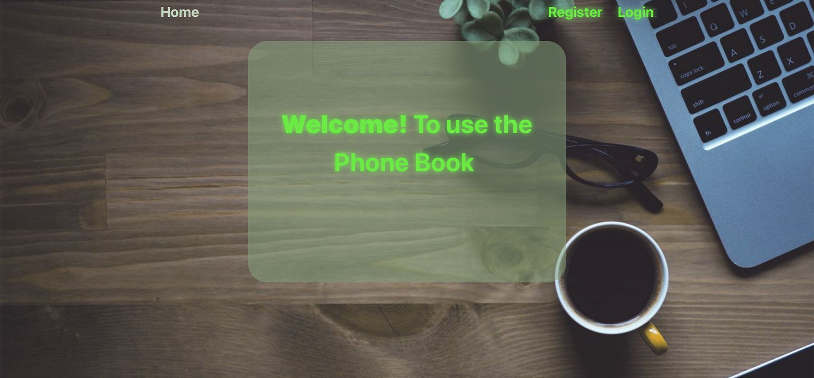
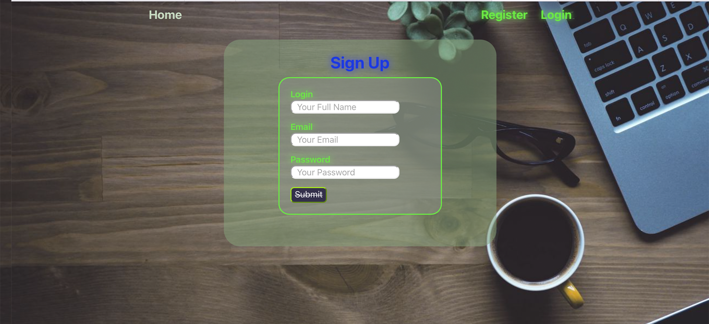
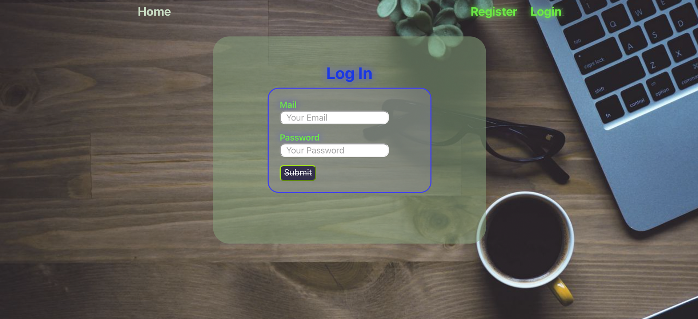
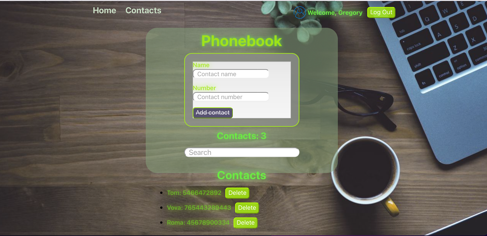
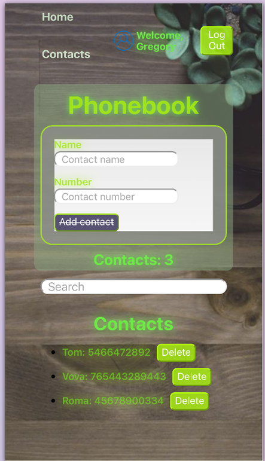

<h1 align="center">Application designed to store contacts.</h1>

Thanks to this application you will be able to store your contacts.

The phone book has a registration function, for private access

Contacts can be added, searched, deleted

Also the phone book is adaptive for mobile devices

The following technologies were used in the development of this application: HTML/CSS Modules/JavaScript/Redux

